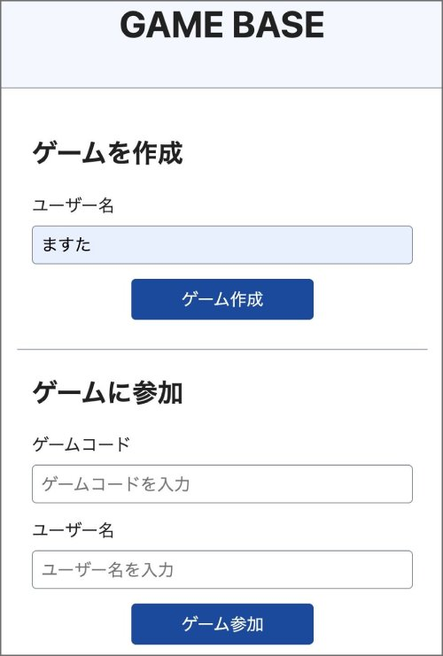
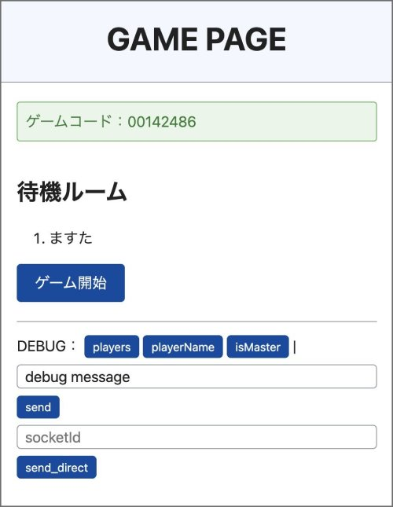
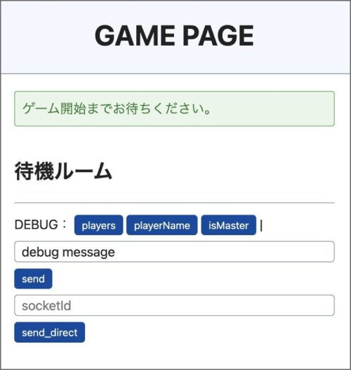
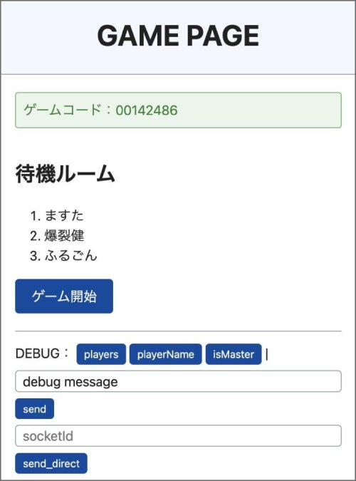
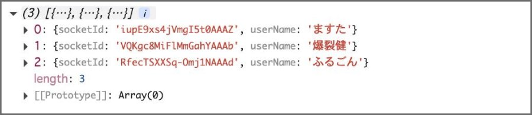

# Socket Game Base Room

リアルタイム多人数参加型ゲーム開発のためのTypeScript基盤（Socket.IO Room使用）

## 概要

Socket Game Base Roomは、Socket.IOを使用したリアルタイム多人数参加型ゲームを構築するためのベースプログラムです。 <br />
マスター/クライアント型のアーキテクチャを採用し、1人のプレイヤー（マスター）がゲームルームを作成し、他のプレイヤーが8桁のゲームコードを使って参加する仕組みになっています。

同じゲームに接続したあとは、`sendMessage()`関数でプレイヤー全員にメッセージを送信できます。Socket.IOのroom機能を利用しています。<br />
また、`sendDirectMessage()`関数で特定のプレイヤーにダイレクトメッセージも送信可能です。<br />
開発者はユーザー名とSocket IDでプレイヤーを管理し、柔軟な通信ゲーム開発ができます。

### 解説ブログ

https://bakuretuken.com/socket_game_base/

## 特徴

- **リアルタイム通信**: Socket.IOによる双方向通信
- **ルーム型システム**: 8桁ゲームコード（重複チェック機能付き）によるルーム管理
- **自動クリーンアップ**: 指定秒後の自動ルーム削除
- **プレイヤー管理**: 指定人数プレイヤー制限（Socket ID付きプレイヤー管理）
- **ダイレクトメッセージ**: 特定プレイヤーへの個別メッセージ送信
- **簡単セットアップ**: Makefileによる開発環境構築

## 必要環境

- Node.js (v16以上推奨)
- npm
- TypeScript

## インストール・セットアップ

```bash
# 依存関係をインストール
make init
```

## 開発

### 開発サーバー起動

```bash
# TypeScript開発サーバー（ホットリロード）
make dev
```

ウォッチモード

```bash
# ファイル変更監視でコンパイル
make watch
```

### ビルド・本番実行

```bash
# TypeScriptビルド
make build
# または
npm run build

# 本番サーバー起動
make up
# または
npm start
```

## ゲーム作成・参加手順

### 1. ゲーム作成（マスター）
   - `http://localhost:8000` にアクセス
   - ユーザー名（最大8文字）を入力
   - 「新しいゲーム作成」をクリック
   - 8桁のゲームコードが表示される

 

### 2. ゲーム参加（クライアント）
   - 同じURLにアクセス
   - ユーザー名と8桁ゲームコードを入力
   - 「ゲームに参加」をクリック

 

### 3. 参加者確認（マスター）
 - 待機ルームに接続されたプレイヤーが表示



 - 「players」ボタンを押すと、playersオブジェクトがコンソールに表示



## ゲーム開発方法

ゲーム固有のロジックを以下のファイルで実装：

- `views/game_master.ts` - マスター用ゲームロジック
- `views/game_player.ts` - クライアント用ゲームロジック

両ファイルで `window.receiveMessage(arr: RecvMessage)` 関数を実装してください。

## アーキテクチャ

### サーバーサイド構成

**メインコンポーネント（server.ts）**:
- Express.js Webサーバー（ポート8000）
- Socket.IOリアルタイム通信
- EJSテンプレートエンジン
- ルーム自動クリーンアップシステム

**HTTPエンドポイント**:
- `GET /` - ランディングページ（index.html）
- `POST /new` - ゲーム作成、マスター用ページレンダリング
- `POST /join` - ゲーム参加、クライアント用ページレンダリング

**Socket.IOイベント**:
- `make` - 8桁ゲームコード生成・ルーム作成
- `join` - ゲームコード使用ルーム参加
- `send` - ルーム内メッセージ送信
- `recv` - メッセージ受信（クライアント側）

### クライアントサイド構成

**共通ロジック（game_base.ts）**:
- Socket.IO接続・切断処理
- プレイヤー管理
- メッセージ送受信ヘルパー関数
- 待機室UI更新

**ゲーム固有ロジック**:
- `game_master.ts` - マスター用実装
- `game_player.ts` - クライアント用実装

### ディレクトリ構造

```
socket_game_base_room/
├── server.ts                 # メインサーバー（Express + Socket.IO）
├── game.ejs                  # ゲームページテンプレート
├── package.json             # 依存関係・スクリプト定義
├── tsconfig.json            # TypeScript設定
├── Makefile                 # 開発用コマンド
├── nodemon.json             # 開発サーバー設定
├── views/
│   ├── index.html           # ランディングページ
│   ├── game_base.ts         # 共通Socket.IOロジック
│   ├── game_master.ts       # マスター用ゲームロジック
│   └── game_player.ts       # クライアント用ゲームロジック
├── types/
│   └── socket-types.ts      # Socket.IO型定義
└── dist/                    # TypeScriptビルド出力
```

## API仕様

### Socket.IO型定義

```typescript
// ゲームコード生成レスポンス
interface MakeResponse {
    status: boolean;
    gameCode: string;
    socketId: string;
}

// ルーム参加レスポンス
interface JoinResponse {
    status: boolean;
    userName: string;
    socketId: string;
}

// メッセージ送受信
interface RecvMessage {
    status: boolean;
    socketId: string;
    action?: string;
    [key: string]: any; // 任意のデータ
}

// ブラウザ用のWindowインターフェース拡張
interface Window {
    receiveMessage: (arr: RecvMessage) => void;
}
```

### ヘルパー関数

```typescript
// ルーム内メッセージ送信
function sendMessage(params: { [key: string]: any }): void

// 特定のユーザーへのダイレクトメッセージ送信
function sendDirectMessage(socketId: string, params: { [key: string]: any }): void

// メッセージ受信処理（要実装）
window.receiveMessage = function(arr: RecvMessage): void {
    // ゲーム固有のロジックを実装
    if (arr.action === 'your_action') {
        // 処理を実装
    }
}
```

## 設定・制限事項

### 環境変数
- `PORT` - サーバーポート（デフォルト: 8000）

### システム制限（変更可能）
- **ゲームコード保持期間**: 300秒（5分）
- **クリーンアップ間隔**: 120秒（2分）
- **最大プレイヤー数**: 8名
- **ユーザー名最大長**: 8文字
- **データ永続化**: なし（メモリ上のみ）

## 開発ワークフロー

1. `make dev` で開発サーバー起動。`make watch`でウォッチモードON
2. TypeScriptファイル編集（自動再コンパイル）
3. ブラウザでテスト（http://localhost:8000）
4. `make build` で本番用ビルド。index.html等の配置は必要

## ライセンス

MIT
